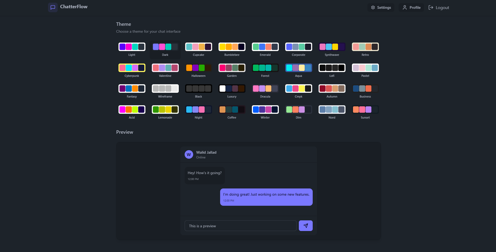

# Real-Time Chat Application

This repository contains the codebase for a **Real-Time Chat Application** built using the MERN stack. The app allows users to communicate instantly and seamlessly, leveraging modern technologies for both the frontend and backend.

## Features

- **Real-Time Messaging**: Instant updates and message delivery using Socket.IO.
- **User Authentication**: Secure login and registration.
- **Responsive Design**: Optimized for all screen sizes using Tailwind CSS and DaisyUI.
- **Efficient Backend**: Built with Express.js and MongoDB for scalable and robust performance.
- **Modern UI**: A clean and user-friendly interface designed with DaisyUI.

---

## Tech Stack

### Frontend:
- **React**: JavaScript library for building user interfaces.
- **Tailwind CSS**: Utility-first CSS framework for styling.
- **DaisyUI**: Tailwind CSS components for rapid UI development.

### Backend:
- **Express.js**: Web application framework for Node.js.
- **MongoDB**: NoSQL database for data storage.
- **Socket.IO**: Real-time, bidirectional communication.
- **Cloudinary**: To store image

---

## Installation and Setup

### Prerequisites
Make sure you have the following installed:
- Node.js (v14 or higher)
- MongoDB
- npm or yarn

### Clone the Repository
```bash
git clone https://github.com/Walid12410/RealTimeChatApp-MERN
cd chat-app
```

### Backend Setup
1. Navigate to the backend directory:
   ```bash
   cd backend
   ```
2. Install dependencies:
   ```bash
   npm install
   ```
3. Set up environment variables:
   Create a `.env` file in the `backend` directory and add the following:
   ```env
   MONGO_URI=
   JWT_SECRET=
   NODE_ENV=

   CLOUDINARY_CLOUD_NAME=
   CLOUDINARY_API_KEY=
   CLOUDINARY_API_SECRET=
   ```
4. Start the server:
   ```bash
   npm run dev
   ```

### Frontend Setup
1. Navigate to the frontend directory:
   ```bash
   cd frontend
   ```
2. Install dependencies:
   ```bash
   npm install
   ```
3. Start the development server:
   ```bash
   npm run dev
   ```

---


## Screenshots




---

## Acknowledgements

- [React](https://reactjs.org/)
- [Tailwind CSS](https://tailwindcss.com/)
- [DaisyUI](https://daisyui.com/)
- [Express.js](https://expressjs.com/)
- [MongoDB](https://www.mongodb.com/)
- [Socket.IO](https://socket.io/)

